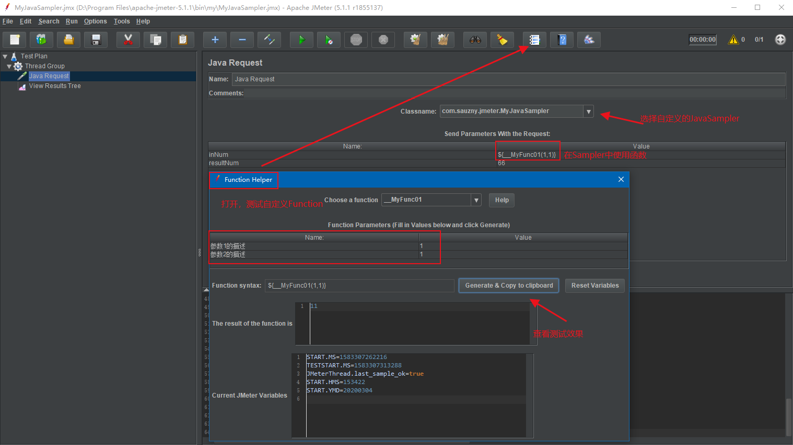

# JMeter

- 自定义MyJavaSampler
  - 继承 `AbstractJavaSamplerClient`
- 自定义Function
  - 包名要包含functions
  - 继承 `AbstractFunction`
  
打包生成jar，放入目录 `lib\ext\` 中

双击bin/jmeter.bat，在gui中使用

图片中 `inNUm` 输入的 `${__MyFunc01(1,1)}`，结果是11

也可以混用，输入 `300${__MyFunc01(1,1)}`，结果就是30011

